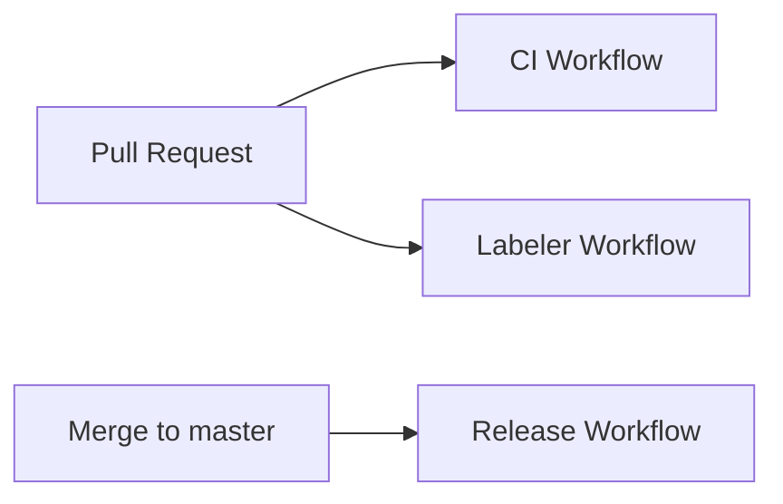
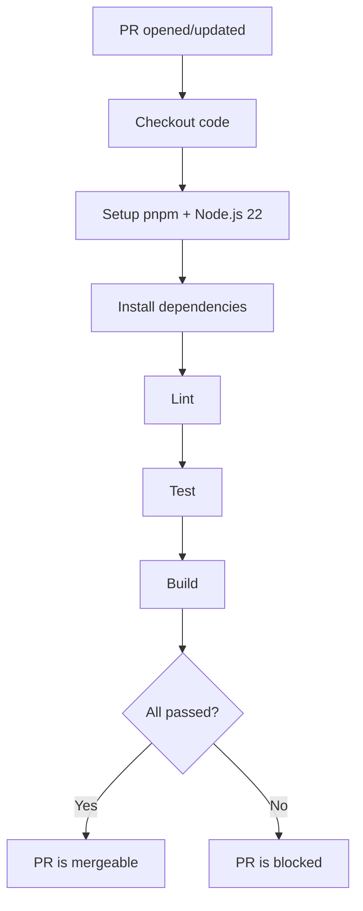
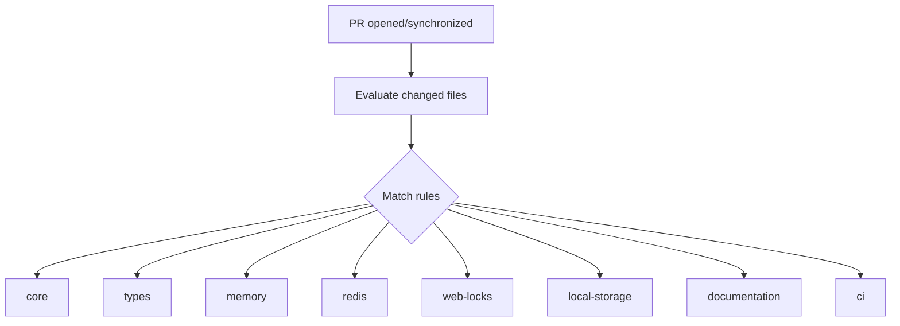
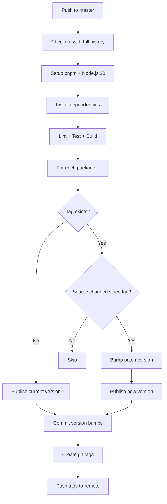

# CI/CD

This document describes the continuous integration and delivery pipelines for universal-lock.

## Overview

The project uses three GitHub Actions workflows:

| Workflow    | Trigger                     | Purpose                         |
| ----------- | --------------------------- | ------------------------------- |
| **CI**      | Pull request to `master`    | Lint, test, and build           |
| **Labeler** | Pull request opened/updated | Auto-label PRs by changed files |
| **Release** | Push to `master`            | Publish changed packages to npm |

## CI Workflow

Runs on every pull request targeting `master`. All checks must pass before merging.

**Steps:**

1. Checkout the repository
2. Setup pnpm and Node.js 22 with dependency caching
3. `pnpm install --frozen-lockfile`
4. `pnpm lint` — static analysis
5. `pnpm test` — unit and integration tests
6. `pnpm build` — compile all packages (ESM, CJS, IIFE)

## Labeler Workflow

Automatically adds labels to pull requests based on which files were changed.

**Label rules:**

| Label           | Matched paths               |
| --------------- | --------------------------- |
| `core`          | `packages/core/**`          |
| `types`         | `packages/types/**`         |
| `memory`        | `packages/memory/**`        |
| `web-locks`     | `packages/web-locks/**`     |
| `local-storage` | `packages/local-storage/**` |
| `redis`         | `packages/redis/**`         |
| `documentation` | `*.md`, `**/*.md`           |
| `ci`            | `.github/**`                |

## Release Workflow

Runs on every push to `master` (typically after merging a PR). Detects which packages have source changes since their last release and publishes them to npm.

**Concurrency:** Only one release job runs at a time (`cancel-in-progress: false`), ensuring sequential publishes.

**Detailed steps:**

1. Checkout with `fetch-depth: 0` for full git history
2. Run lint, test, and build as a safety check
3. For each package in `packages/*/`:
    - Read the package name and version from `package.json`
    - Construct the tag `<name>@<version>`
    - If the tag doesn't exist, publish the current version as-is
    - If the tag exists, diff source files (`src/`) against the tag
    - If source changed, bump the patch version and publish
    - If no changes, skip
4. Commit any version bumps (`chore: release <packages>`)
5. Create git tags for all published versions
6. Push commits and tags to `master`

**Required secrets:**

| Secret         | Purpose                                      |
| -------------- | -------------------------------------------- |
| `GITHUB_TOKEN` | Push commits and tags back to the repository |
| `NPM_TOKEN`    | Authenticate with the npm registry           |

**npm provenance:** Packages are published with `--provenance` for supply chain transparency, enabled by the `id-token: write` permission.
